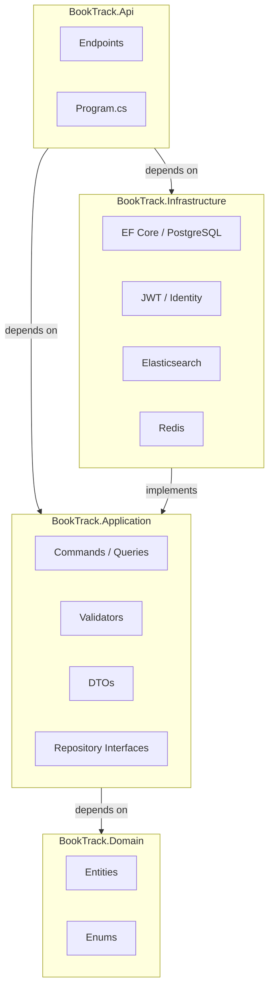

# BookTrack

[](https://github.com/DaftCod/booktrack/actions/workflows/ci.yml)


> A personal book-tracking web app built as a **Clean Architecture + CQRS** showcase on .NET 10 and React 18. Track reading status, rate books, and discover new reads — all backed by a production-grade backend with JWT auth, EF Core, OpenTelemetry, and a fully containerised development environment.

---

## Screenshots

| Browse Catalog | My Library | Library Stats |
|---|---|---|
|  |  |  |

---

## Features

### For readers
- **Browse catalog** — search by title or author, filter by genre, sort by rating / year / title
- **Book details** — description, cover art, page count, publish year, community rating, ISBN
- **Personal library** — add books with a reading status: *Want to Read*, *Reading*, or *Read*
- **Star ratings** — rate any book in your library (1–5 stars); average recalculates live
- **Reading stats** — overview of your library totals per status

### For admins
- **Add to catalog** — search Open Library, select a book and auto-populate metadata (description, community rating, cover, ISBN, page count, authors, genres)
- **Remove books** — delete any book from the catalog

### Platform
- JWT authentication — register / login, 24-hour tokens, role-based (`Admin` / `Guest`)
- Structured logging with **Serilog**
- Distributed tracing with **OpenTelemetry → Jaeger**
- Full **Docker Compose** stack (one command to run everything)
- **CI/CD** via GitHub Actions — lint, build, test, Docker image build & push to GHCR on `main`

---

## Architecture

BookTrack follows **Clean Architecture** with strict inward dependency rules enforced by architecture tests at every CI run.



| Layer | Responsibility |
|---|---|
| **Domain** | `Book`, `Author`, `Genre`, `UserBook` entities; `ReadingStatus` enum. Zero dependencies. |
| **Application** | CQRS commands & queries via MediatR, FluentValidation validators, repository interfaces, DTOs. |
| **Infrastructure** | EF Core + PostgreSQL, ASP.NET Identity, JWT token service, repository implementations. |
| **API** | Minimal API endpoints, DI bootstrap, middleware, OpenTelemetry, Serilog. |

### CQRS command map

| Command / Query | Description |
|---|---|
| `RegisterCommand` | Create account, return JWT |
| `LoginCommand` | Authenticate, return JWT |
| `GetBooksQuery` | List all books in catalog |
| `GetBookByIdQuery` | Single book with authors & genres |
| `AddBookCommand` | Admin: add book to catalog |
| `RemoveBookCommand` | Admin: delete book from catalog |
| `GetUserBooksQuery` | Authenticated user's library |
| `AddUserBookCommand` | Add book to personal library with status |
| `RemoveUserBookCommand` | Remove book from library |
| `RateUserBookCommand` | Set 1–5 star rating; recalculates `Book.AverageRating` |

---

## Tech Stack

### Backend
| Technology | Version | Role |
|---|---|---|
| [ASP.NET Core](https://learn.microsoft.com/aspnet/core) | .NET 10 | Minimal API host |
| [Entity Framework Core](https://learn.microsoft.com/ef/core) | 9.x | ORM + migrations |
| [ASP.NET Core Identity](https://learn.microsoft.com/aspnet/core/security/authentication/identity) | — | User management & roles |
| [MediatR](https://github.com/jbogard/MediatR) | 12.x | CQRS mediator |
| [FluentValidation](https://docs.fluentvalidation.net) | 11.x | Command validators |
| [ErrorOr](https://github.com/amantinband/error-or) | 2.x | Discriminated-union error handling |
| [Serilog](https://serilog.net) | 4.x | Structured logging |
| [OpenTelemetry](https://opentelemetry.io) | — | Traces → Jaeger via OTLP |
| [NetArchTest](https://github.com/BenMorris/NetArchTest) | — | Architecture tests |

### Frontend
| Technology | Version | Role |
|---|---|---|
| [React](https://react.dev) | 18.3 | UI framework |
| [TypeScript](https://typescriptlang.org) | 5.5 | Type safety |
| [Vite](https://vitejs.dev) | 5.4 | Build tool & dev server |
| [TanStack Query](https://tanstack.com/query) | 5.x | Server state & caching |
| [Axios](https://axios-http.com) | 1.7 | HTTP client |
| [Tailwind CSS](https://tailwindcss.com) | 3.4 | Utility-first styling |
| [React Hook Form](https://react-hook-form.com) | 7.x | Form management |
| [Zod](https://zod.dev) | 3.x | Schema validation |
| [Lucide React](https://lucide.dev) | — | Icons |

### Infrastructure
| Service | Image | Purpose |
|---|---|---|
| PostgreSQL | `postgres:16-alpine` | Primary database |
| Redis | `redis:7-alpine` | Caching layer |
| Elasticsearch | `8.13.4` | Full-text search |
| Jaeger | `all-in-one:latest` | Distributed tracing UI |

---

## Project Structure

```
booktrack/
├── src/
│   ├── BookTrack.Domain/          # Entities, enums — no dependencies
│   │   ├── Entities/
│   │   │   ├── Book.cs
│   │   │   ├── Author.cs
│   │   │   ├── Genre.cs
│   │   │   └── UserBook.cs
│   │   └── Enums/
│   │       └── ReadingStatus.cs
│   │
│   ├── BookTrack.Application/     # CQRS, validators, interfaces
│   │   ├── Auth/Commands/
│   │   ├── Books/Commands|Queries/
│   │   └── UserBooks/Commands|Queries/
│   │
│   ├── BookTrack.Infrastructure/  # EF Core, Identity, JWT, repos
│   │   ├── Auth/
│   │   ├── Identity/
│   │   ├── Persistence/
│   │   │   ├── Repositories/
│   │   │   ├── Configurations/
│   │   │   └── Migrations/
│   │   └── DependencyInjection.cs
│   │
│   └── BookTrack.Api/             # Minimal API, DI bootstrap
│       ├── Endpoints/
│       │   ├── AuthEndpoints.cs
│       │   ├── BooksEndpoints.cs
│       │   └── UserBooksEndpoints.cs
│       └── Program.cs
│
├── tests/
│   ├── BookTrack.Domain.Tests/
│   ├── BookTrack.Application.Tests/
│   ├── BookTrack.Architecture.Tests/   # NetArchTest layering rules
│   └── BookTrack.IntegrationTests/     # Testcontainers + PostgreSQL
│
├── frontend/                      # React + Vite SPA
│   └── src/
│       ├── pages/                 # BrowsePage, MyLibraryPage, StatsPage
│       ├── components/            # BookCard, BookDetailModal, StarRating, …
│       ├── api/                   # Axios wrappers (books, userBooks, auth)
│       ├── contexts/              # AuthContext (JWT, interceptors)
│       └── types/                 # BookDto, UserBookDto, ReadingStatus
│
├── docs/
│   └── screenshots/
├── docker-compose.yml
└── .github/workflows/ci.yml
```

---

## Getting Started

### Prerequisites

- [Docker Desktop](https://www.docker.com/products/docker-desktop/) (includes Compose)

That's it. The entire stack — API, frontend, PostgreSQL, Redis, Elasticsearch, Jaeger — runs in containers.

### Run with Docker Compose

```bash
git clone https://github.com/DaftCod/booktrack.git
cd booktrack
docker compose up -d
```

| Service | URL |
|---|---|
| Frontend | http://localhost:5173 |
| API | http://localhost:5085 |
| API health | http://localhost:5085/health |
| Jaeger UI | http://localhost:16686 |
| Elasticsearch | http://localhost:9200 |

The API auto-applies EF Core migrations and seeds an admin account on first start.

---

## API Reference

### Auth

| Method | Path | Auth | Description |
|---|---|---|---|
| `POST` | `/api/auth/register` | — | Register a new account |
| `POST` | `/api/auth/login` | — | Sign in, receive JWT |

### Books

| Method | Path | Auth | Description |
|---|---|---|---|
| `GET` | `/api/books` | — | List all books |
| `GET` | `/api/books/{id}` | — | Get book by ID |
| `POST` | `/api/books` | Admin | Add book to catalog |
| `DELETE` | `/api/books/{id}` | Admin | Remove book from catalog |

### User Library

| Method | Path | Auth | Description |
|---|---|---|---|
| `GET` | `/api/user/books` | Bearer | Get personal library |
| `POST` | `/api/user/books` | Bearer | Add book with reading status |
| `DELETE` | `/api/user/books/{bookId}` | Bearer | Remove from library |
| `PUT` | `/api/user/books/{bookId}/rating` | Bearer | Set star rating (1–5) |

---

## Testing

```bash
# All unit & architecture tests
dotnet test BookTrack.slnx --configuration Release --filter "FullyQualifiedName!~IntegrationTests"

# Integration tests (requires Docker for Testcontainers)
dotnet test BookTrack.slnx --filter "FullyQualifiedName~IntegrationTests"
```

Architecture tests (`BookTrack.Architecture.Tests`) run on every CI build and enforce:
- Domain has no dependency on any other layer
- Application has no dependency on Infrastructure or API
- Infrastructure has no dependency on API
- Types reside in their correct namespace

---

## Observability

Distributed traces are exported via OTLP to Jaeger. Open the Jaeger UI at **http://localhost:16686** and select `BookTrack.Api` to view traces for every request.

Application logs are written by Serilog with structured JSON output in production.

---

## CI / CD

The GitHub Actions pipeline runs on every push and pull request to `main` / `master`:

```
push / PR
    ├── Backend — restore → build (Release) → unit & arch tests → codecov
    ├── Frontend — npm ci → eslint → tsc + vite build
    └── Build images (after both pass)
            ├── Build API Docker image
            ├── Build frontend Docker image (prod target)
            └── Push to GHCR (main branch only)
```

---

## License

MIT
